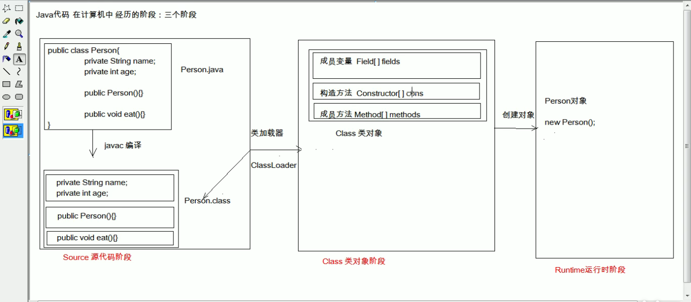

### Junit使用：
1. 定义一个测试类
建议：测试类名：被测试类名加Test
包名：xxx.xxx.xx.test
2. 定义测试方法：可以独立运行
建议：方法名，testXxx
返回值：void
参数列表:空参
3. 给方法加@Test注解
4. 导入Junit依赖
判定结果：红色失败，绿色成功，一般使用断言操作处理结果
@Before注解用于资源申请
@After注解用于资源释放
### 反射：框架设计的灵魂
* 框架：半成品软件，可以在框架的基础上进行软件开发，简化编码。
* 反射:将类的各个组成部分封装成其他对象，这就是反射机制。 好处:
1. 可以在程序运行过程中，操作这些对象。
2. 可以解耦，提高程序的可扩展性。
* 获取Class对象的方式：
  1. Class.forName("全类名"):将字节码文件加载进内存，返回Class对象
  2. 类名.Class：通过类名的属性class获取
  3. 对象getClass():getClass()方法在Object类中定义着。
  结论：同一个字节码（*.class）在一次程序运行过程中，只会被加载一次，不论通过哪一种方式获取的Class对象都是同一个。
* Class对象功能：
  * 获取功能:
  1. 获取成员变量们
     * Field[]getFields();获取所有public修饰的成员变量
     * Field getField(String name);获取指定名称的public修饰的成员变量
     * Filed getDeclaredFields();获取所有的成员变量不考虑修饰符
     * Field getDeclaredField(String name);
  2. 获取构造方法们
     * Constructor<?>[] getConstructors()
     * Constructor<T> getConstructor(类<?>...parameterTypes)
     * Constructor<T> getDeclaredConstructor(类<?>... parameterTypes)
     * Constructor<?>[] getDeclaredConstructors()
  3. 获取成员方法们
     * Method[] getMethods();
     * Method getMethod(String name,类<?>... parameterTypes)
     * Method[] getDeclaredMethods();
     * Method getDeclaredMethod(String name,类<?>... parameterTypes);
  4. 获取类名
     * String getName();
* Field:成员变量
    * 操作：
    1. 设置值
        * void set(Object obj,Object value)
    2. 获取值
        * get(Object obj)
    3. 忽略访问权限修饰符的安全检查
        * setAccessible(true); //暴力反射
* Constructor：构造方法
    * 创建对象：T newInstance(Object... initrans);
    * 如果使用空参数构造函数，操作可以简化，Class对象的newInstance方法
##### java代码在计算机中经历的阶段:三个阶段
* Source 源代码阶段 -> Class类对象阶段 -> Runtime运行时阶段
  
